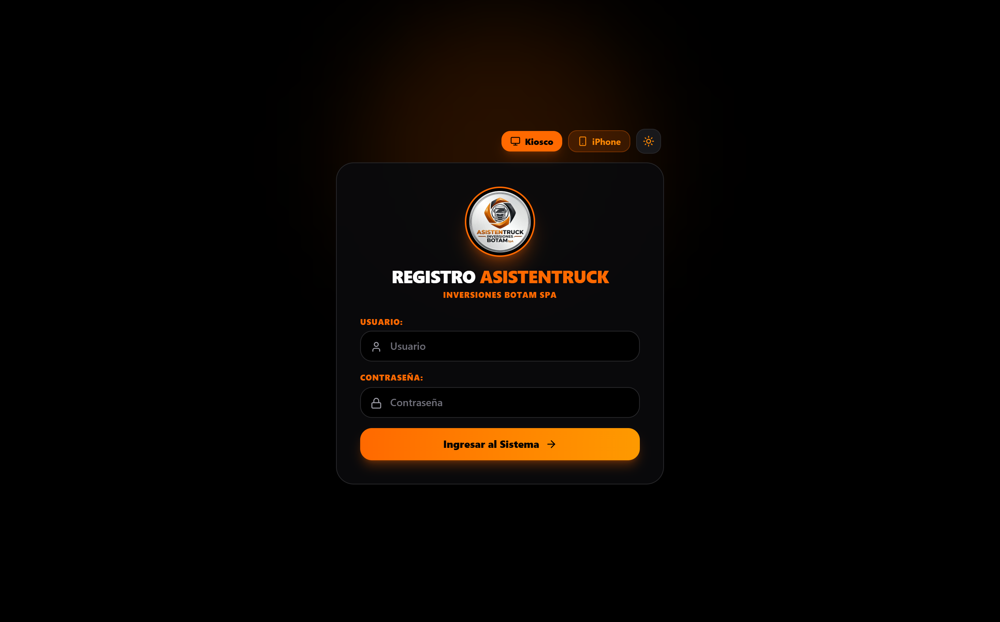
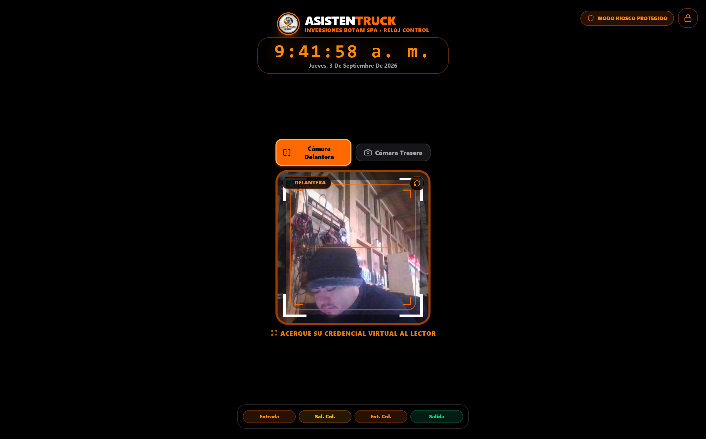
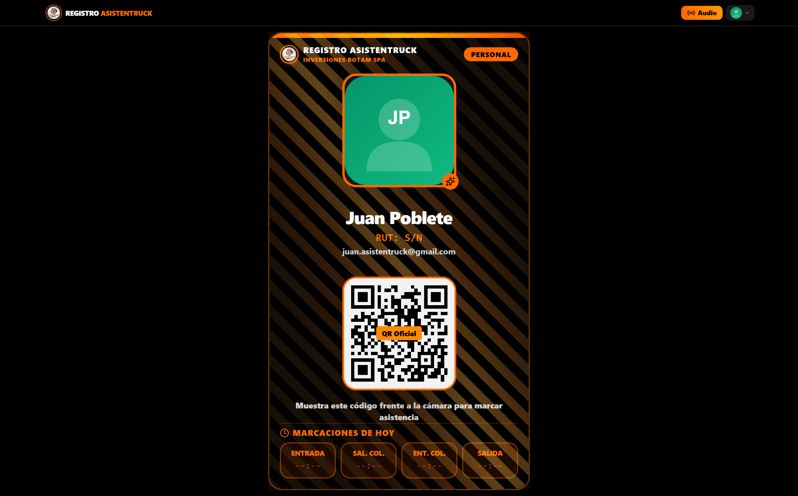
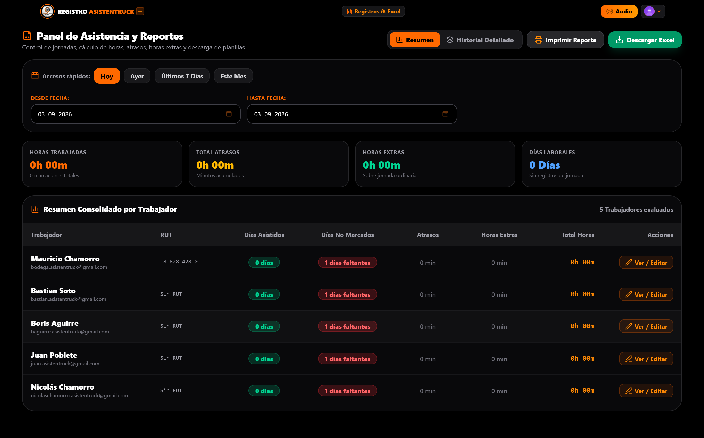
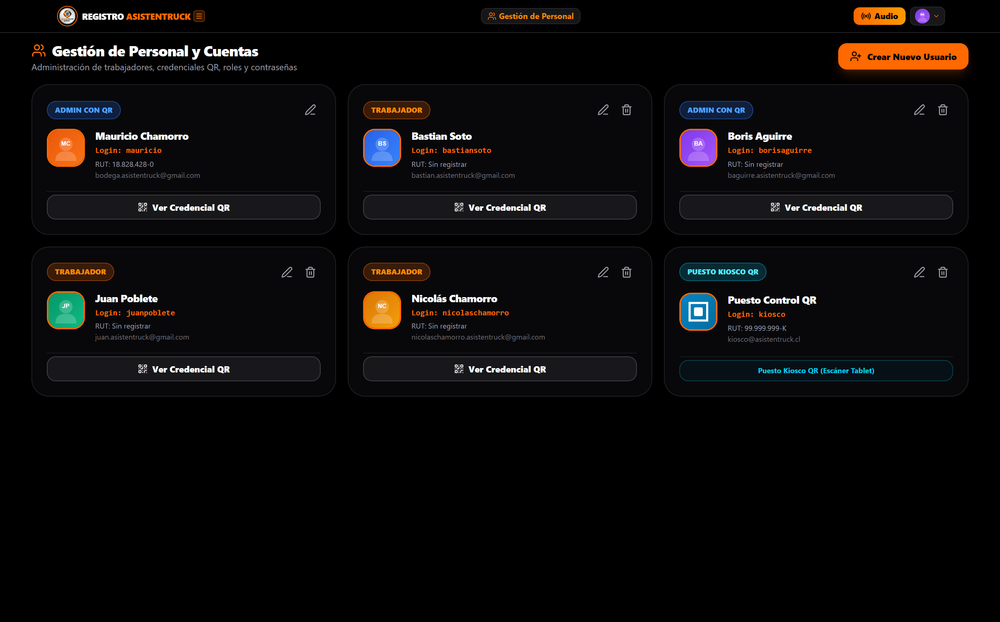
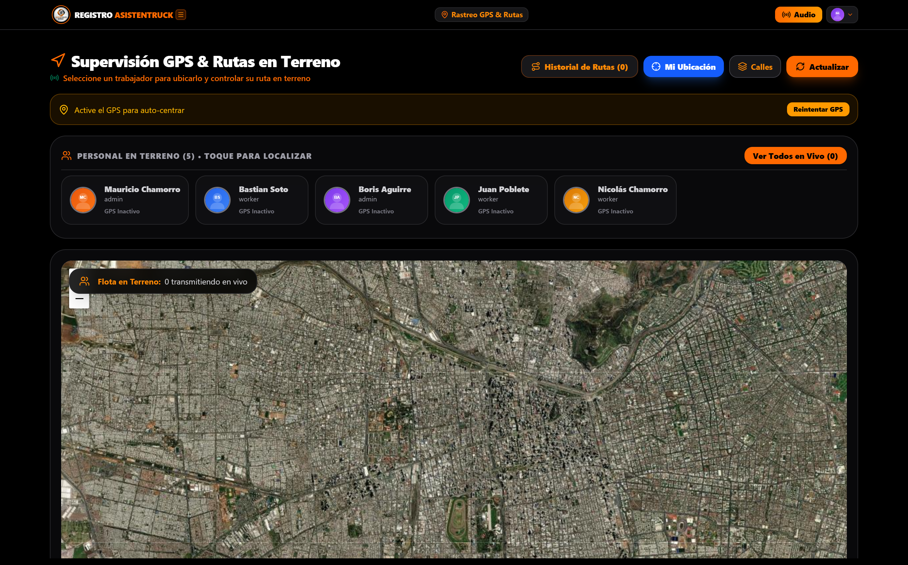
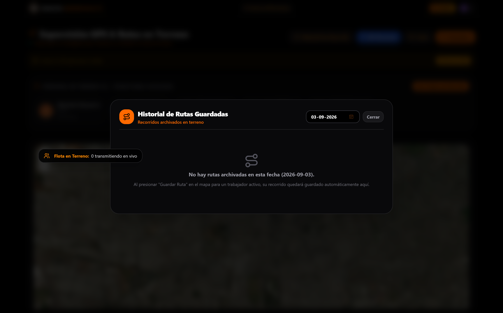
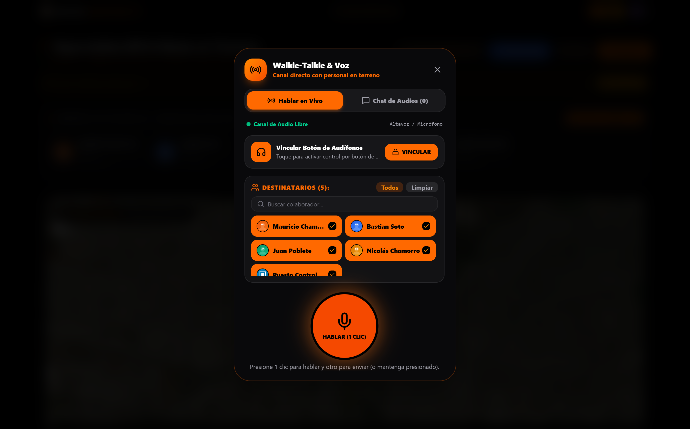

# Manual de Operación y Manejo Integral
## Sistema de Control de Asistencia, Rutas y Comunicación — AsistenTruck
### Inversiones Botam SpA

Bienvenido al manual oficial de usuario de **AsistenTruck**. Este documento ha sido diseñado paso a paso para que cualquier persona, sin importar si nunca antes ha utilizado el programa o si no tiene conocimientos técnicos previos, pueda comprender, dominar y operar todas las funciones del sistema con total fluidez y seguridad.

---

## Índice General

1. [Visión General y Roles del Sistema](#1-visión-general-y-roles-del-sistema)
2. [Acceso al Sistema e Inicio de Sesión](#2-acceso-al-sistema-e-inicio-de-sesión)
3. [Modo Kiosco: Reloj Control y Escáner de Entrada/Salida](#3-modo-kiosco-reloj-control-y-escáner-de-entradasalida)
4. [Credencial Digital del Trabajador](#4-credencial-digital-del-trabajador)
5. [Panel de Control de Asistencia y Reportes (Administrador)](#5-panel-de-control-de-asistencia-y-reportes-administrador)
6. [Gestión de Personal y Credenciales QR (Administrador)](#6-gestión-de-personal-y-credenciales-qr-administrador)
7. [Supervisión GPS y Rutas en Terreno (Administrador)](#7-supervisión-gps-y-rutas-en-terreno-administrador)
8. [Historial de Rutas Guardadas y Auditoría de Recorridos](#8-historial-de-rutas-guardadas-y-auditoría-de-recorridos)
9. [Radio Radial Walkie-Talkie Push-to-Talk (PTT)](#9-radio-radial-walkie-talkie-push-to-talk-ptt)
10. [Preguntas Frecuentes y Guía Rápida de Solución de Problemas](#10-preguntas-frecuentes-y-guía-rápida-de-solución-de-problemas)

---

## 1. Visión General y Roles del Sistema

**AsistenTruck** es una plataforma tecnológica integral diseñada para optimizar la gestión de jornadas laborales, control biométrico de asistencia mediante códigos QR seguros, supervisión logística de flota en terreno y comunicación radial instantánea.

### Perfiles de Operación
El sistema cuenta con tres tipos de perfiles según la tarea que desempeña cada persona:

1. **Trabajador / Conductor en Terreno:**
   - Cuenta con su **Credencial Digital** en su teléfono móvil.
   - Presenta su código QR ante el Kiosco de la empresa al llegar y salir.
   - Visualiza en tiempo real el registro de sus marcaciones del día.
   - Puede comunicarse con la central y sus compañeros mediante el canal de audio radial (Walkie-Talkie).
2. **Puesto de Control Kiosco (Tablet / Estación Fija):**
   - Dispositivo instalado en el acceso de la empresa o taller.
   - Funciona como reloj control continuo con reloj sincronizado oficial de Chile.
   - Escanea automáticamente las credenciales QR de los colaboradores a través de su cámara de video.
3. **Administrador Operacional:**
   - Supervisa el cumplimiento de jornadas, atrasos, inasistencias y horas extras.
   - Consulta y exporta informes consolidados en planillas Excel (.xlsx) o formato de impresión.
   - Administra la nómina de trabajadores y genera sus credenciales QR.
   - Supervisa en un mapa satelital la posición de la flota en terreno y archiva los recorridos realizados.

---

## 2. Acceso al Sistema e Inicio de Sesión

Para ingresar a AsistenTruck, abra el navegador web (Google Chrome, Microsoft Edge o Safari en iPhone/iPad) o abra la aplicación instalada en su dispositivo móvil.

### Elementos de la Pantalla de Acceso:
1. **Identificación Institucional:** Encabezado con el logotipo oficial de AsistenTruck y la razón social *Inversiones Botam SpA*.
2. **Campo USUARIO:** Ingrese su nombre de usuario asignado (ejemplo: `juanpoblete`, `borisaguirre` o `kiosco`).
3. **Campo CONTRASEÑA:** Ingrese su clave de seguridad confidencial.
4. **Botón "Ingresar al Sistema":** Valida sus credenciales y lo redirige automáticamente a la vista correspondiente a su perfil.
5. **Acceso Directo "Kiosco":** Ubicado en la esquina superior derecha, permite ingresar de inmediato al módulo de reloj control para la tablet de portería sin necesidad de tipear contraseñas en cada turno.
6. **Guía "iPhone":** Muestra instrucciones gráficas para anclar la aplicación directamente a la pantalla de inicio de teléfonos Apple (Safari).
7. **Selector de Tema (Sol/Luna):** Permite alternar entre Modo Oscuro (alto contraste para noche) y Modo Claro.

---

## 3. Modo Kiosco: Reloj Control y Escáner de Entrada/Salida

El **Modo Kiosco** es la estación central de marcación ubicada en las dependencias de la empresa.

### ¿Cómo marcar asistencia paso a paso?

#### Paso 1: Seleccione el Tipo de Marcación
En la parte inferior de la pantalla, toque el botón correspondiente a la acción que va a realizar:
- **Entrada:** Al comenzar su turno o jornada laboral matutina.
- **Sal. Col. (Salida a Colación):** Al salir a su horario de almuerzo o colación.
- **Ent. Col. (Entrada de Colación):** Al regresar de su colación para reanudar labores.
- **Salida:** Al terminar definitivamente su turno o jornada de trabajo.

> [!TIP]
> El botón seleccionado se iluminará con un contorno de color esmeralda/naranja brillante, confirmando qué marcación se encuentra activa.

#### Paso 2: Presente su Credencial QR
- Encienda la pantalla de su teléfono con su Credencial Digital abierta, o bien muestre su credencial plástica física.
- Coloque el código QR a una distancia de entre 15 a 30 centímetros frente al recuadro de la cámara.
- El sistema emitirá un sonido de confirmación, mostrará en pantalla la fotografía y el nombre del trabajador con un mensaje de éxito en verde (ej: *"Entrada registrada exitosamente: 08:02 hrs"*), y actualizará inmediatamente la base de datos central.

### Características Especiales del Modo Kiosco:
- **Reloj Digital Oficial:** Muestra la hora exacta, minutos, segundos y fecha completa en la zona horaria legal de Chile continental (`America/Santiago`).
- **Alternar Cámara:** Botones para seleccionar entre *"Cámara Delantera"* (frontal) y *"Cámara Trasera"*, adaptándose a cualquier base o soporte de tablet.
- **Modo de Ahorro y Suspensión Inteligente:** Tras 5 minutos sin actividad de personas frente al kiosco, la pantalla entra en reposo para preservar la batería de la tablet, reactivándose de forma ultra-rápida en cuanto una persona aproxima su teléfono.
- **Modo Kiosco Protegido:** Bloquea la navegación externa para evitar que personas no autorizadas cierren el reloj control.

---

## 4. Credencial Digital del Trabajador

Cada colaborador tiene acceso a su propia credencial digital personalizada en su teléfono móvil.

### Contenido de la Credencial:
1. **Cabecera Oficial:** Logotipo de AsistenTruck e insignia identificatoria de rol (**PERSONAL**).
2. **Fotografía de Perfil / Avatar:** Muestra la foto oficial o las iniciales del trabajador.
3. **Nombre y RUT:** Identificación completa del trabajador (ejemplo: *Juan Poblete*).
4. **Código QR Oficial e Intransferible:** Generado de forma dinámica y segura para ser leído por el Kiosco.
5. **Panel "MARCACIONES DE HOY":**
   Permite al trabajador verificar al instante sus 4 hitos del día:
   - **ENTRADA:** Hora exacta de inicio (ej: `08:00`).
   - **SAL. COL.:** Salida a colación (ej: `13:00`).
   - **ENT. COL.:** Regreso de colación (ej: `14:00`).
   - **SALIDA:** Término de jornada (ej: `18:00`).
6. **Botón Radial "Audio":** Permite al trabajador acceder directamente al canal de Walkie-Talkie para comunicarse por voz con la central de operaciones.

---

## 5. Panel de Control de Asistencia y Reportes (Administrador)

El módulo de **Asistencia y Reportes** es el centro neurálgico donde la jefatura de operaciones y administración supervisa la puntualidad y cumplimiento de todos los colaboradores.

### 1. Indicadores Clave en Tiempo Real (Tarjetas Superiores)
- **HORAS TRABAJADAS:** Horas y minutos totales acumulados efectivamente por el equipo en el período seleccionado.
- **TOTAL ATRASOS:** Minutos totales acumulados por ingresos posteriores al horario de tolerancia oficial.
- **HORAS EXTRAS:** Tiempo laborado que sobrepasa la jornada ordinaria legal pactada.
- **DÍAS LABORALES:** Total de días hábiles transcurridos dentro del rango de fechas bajo análisis.

### 2. Barra de Accesos Rápidos y Selector de Fechas
En lugar de tener que ingresar manualmente fechas en un calendario, el administrador dispone de botones de un solo toque:
- **[Hoy]:** Filtra inmediatamente la jornada en curso.
- **[Ayer]:** Muestra el día anterior completo para auditoría de cierre.
- **[Últimos 7 Días]:** Despliega el consolidado semanal.
- **[Este Mes]:** Calcula la totalidad del mes en curso listo para liquidaciones.
- **Selectores "Desde Fecha" y "Hasta Fecha":** Permiten definir cualquier intervalo histórico personalizado.

### 3. Tabla de Resumen Consolidado por Trabajador
Cada trabajador figura con sus indicadores consolidados:
- **Trabajador:** Nombre y correo electrónico registrado.
- **RUT:** Cédula de identidad oficial.
- **Días Asistidos:** Conteo de jornadas en las que el colaborador marcó asistencia.
- **Días No Marcados (Inasistencias):** Marcado en rojo con alerta visible (ej: `1 días faltantes`), identificando de inmediato si un colaborador faltó o no registró marcación en un día laboral.
- **Atrasos:** Minutos exactos de demora acumulada.
- **Horas Extras:** Horas adicionales generadas.
- **Total Horas:** Sumatoria exacta en formato `Xh YYm`.
- **Botón "Ver / Editar":** Permite al administrador revisar el detalle o regularizar incidencias justificadas (como licencias médicas o permisos con goce de sueldo).

### 4. Herramientas de Exportación
- **[Descargar Excel]:** Genera un archivo `.xlsx` estructurado y compatible con Microsoft Excel, Google Sheets y LibreOffice, listo para RRHH y contabilidad.
- **[Imprimir Reporte]:** Abre la vista optimizada de impresión para generar un PDF formal o imprimir físicamente en papel con membrete institucional.

---

## 6. Gestión de Personal y Credenciales QR (Administrador)

Este módulo permite dar de alta, modificar y organizar las fichas del equipo humano de la empresa.

### Funcionalidades Disponibles:
1. **Crear Nuevo Usuario:** Mediante el botón naranja superior `+ Crear Nuevo Usuario`, se abre el formulario para ingresar:
   - Nombre completo.
   - Cédula de Identidad (RUT).
   - Nombre de usuario para inicio de sesión.
   - Cargo u ocupación dentro de la empresa.
   - Rol del sistema (**TRABAJADOR** o **ADMIN**).
   - Contraseña de acceso.
2. **Tarjetas de Personal:** Cada colaborador dispone de una tarjeta con su nombre, usuario, RUT y correo.
3. **Botón "Ver Credencial QR":** Abre en pantalla completa la credencial del trabajador para que pueda ser fotografiada, descargada o impresa en PVC/papel para entrega física.
4. **Iconos de Edición (Lápiz):** Permite actualizar datos personales, restablecer contraseñas o modificar cargos en cualquier momento.

---

## 7. Supervisión GPS y Rutas en Terreno (Administrador)

Permite visualizar la ubicación geográfica de los conductores y cuadrillas en terreno sobre un mapa de alta precisión satelital y de calles.

### ¿Cómo supervisar y registrar un recorrido?

1. **Panel Superior de Colaboradores ("Personal en Terreno"):**
   - Muestra las fichas de todos los trabajadores disponibles.
   - Al hacer **un clic sobre un trabajador**, el mapa se auto-centra inmediatamente en su posición satelital y se activa el monitoreo de su ubicación.
   - Al presionar **nuevamente sobre el mismo trabajador**, se desactiva el rastreo de ese colaborador de manera inmediata.
2. **Capas del Mapa:**
   - Botón **[Calles / Satélite]**: Alterna entre la vista cartográfica de calles y la vista satelital fotográfica en alta resolución.
   - Botón **[Mi Ubicación]**: Centra la vista en el punto actual del administrador.
   - Botón **[Actualizar]**: Refresca instantáneamente las coordenadas transmitidas.
3. **Control y Registro de Rutas en Terreno:**
   - En el panel inferior del mapa, el administrador puede iniciar el trazado de un viaje mediante **[Comenzar Ruta]**.
   - El sistema calculará la distancia recorrida en kilómetros, velocidad media y trazará la polilínea exacta ajustada a las vías de tránsito.
   - Al finalizar el recorrido, presione **[Guardar Ruta]** para archivar la auditoría en la base de datos histórica.

---

## 8. Historial de Rutas Guardadas y Auditoría de Recorridos

El sistema cuenta con un archivo histórico donde se guardan todos los viajes y trayectos finalizados para respaldar servicios a clientes y auditorías operacionales.

### Características del Historial:
- **Selector de Fecha:** Permite buscar y consultar recorridos archivados de cualquier día del año.
- **Detalle de la Ruta:** Muestra el nombre del conductor o vehículo, hora de inicio, hora de término, distancia total recorrida en kilómetros (km) y cantidad de puntos GPS registrados.
- **Visualización en Mapa:** Al seleccionar una ruta archivada, el sistema dibuja sobre el mapa satelital el camino exacto que transitó el camión o vehículo, permitiendo verificar paradas, desvíos y tiempos de traslado.

---

## 9. Radio Radial Walkie-Talkie Push-to-Talk (PTT)

AsistenTruck integra un sistema de radiocomunicación por voz en tiempo real que funciona a través de Internet (4G, 5G y Wi-Fi), permitiendo a conductores y supervisores comunicarse sin depender de números telefónicos tradicionales.

### ¿Cómo transmitir un mensaje de voz?

#### Opción A: Transmisión con 1 Clic (Modo Manos Libres)
1. Abra el canal de voz presionando el botón superior **[Audio]**.
2. Seleccione a los destinatarios (puede marcar **[Todos]** para hablar por el Canal General o seleccionar personas específicas).
3. Presione una vez el botón circular central **[HABLAR (1 CLIC)]**: el botón se iluminará y comenzará a capturar su voz.
4. Al terminar de hablar, presione nuevamente el botón para enviar la transmisión de inmediato.

#### Opción B: Mantener Presionado (Modo Radio Tradicional)
- Mantenga su dedo presionado sobre el botón naranja central mientras habla.
- Al soltar el dedo, la transmisión se envía al instante al receptor.

### Pestaña "Chat de Audios":
- Guarda el historial de notas de voz recibidas y enviadas durante el turno, permitiendo reproducirlas cuantas veces sea necesario en caso de haber estado conduciendo o realizando maniobras en el momento de la transmisión.

---

## 10. Preguntas Frecuentes y Guía Rápida de Solución de Problemas

### 1. ¿Qué debo hacer si el escáner del Kiosco no lee mi código QR?
- **Brillo de la pantalla:** Asegúrese de que el brillo de su teléfono celular esté al 80% o más.
- **Distancia:** Mantenga el teléfono firme a unos 20 cm de la cámara, sin moverlo rápidamente.
- **Reflejos:** Evite que luces directas o el sol den de frente a la pantalla de su teléfono.

### 2. ¿Cómo instalar AsistenTruck como una aplicación en iPhone?
1. Abra el enlace web en el navegador **Safari**.
2. Toque el botón de **Compartir** de Safari (el ícono del cuadrado con una flecha hacia arriba).
3. Desplace hacia abajo y elija **"Agregar a pantalla de inicio"**.
4. Toque **"Agregar"**. La aplicación quedará guardada como un ícono en su pantalla con acceso a pantalla completa y soporte de audio.

### 3. ¿Qué ocurre si un trabajador olvida marcar su salida?
El administrador puede ingresar al módulo de **Asistencia**, ubicar la fila del colaborador en el día correspondiente, presionar el botón **Ver / Editar** y registrar administrativamente la hora de salida correspondiente, añadiendo una nota explicativa para respaldo de la empresa.

### 4. ¿El sistema funciona sin conexión a Internet?
El Kiosco y la app móvil están optimizados para operar con redes móviles estándar. En caso de microcortes temporales de señal, el sistema retiene los estados en memoria y sincroniza automáticamente las marcaciones en cuanto se restablece la conectividad.

---
*Manual de Usuario Oficial — AsistenTruck | Inversiones Botam SpA — Todos los derechos reservados.*
